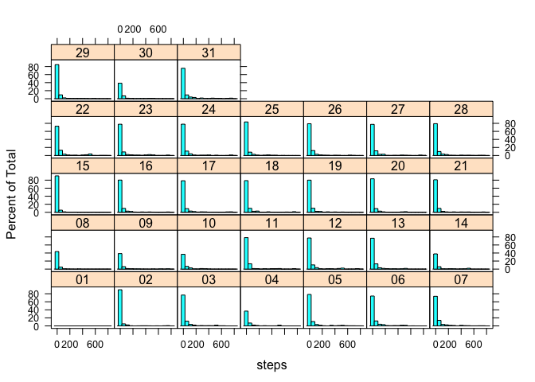
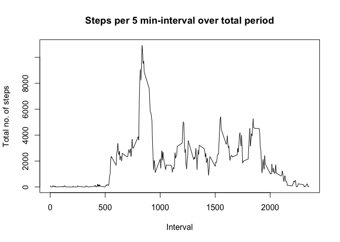
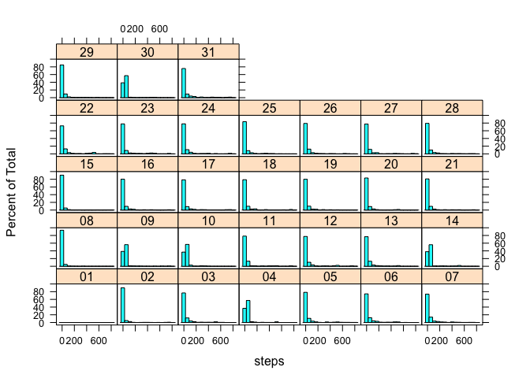
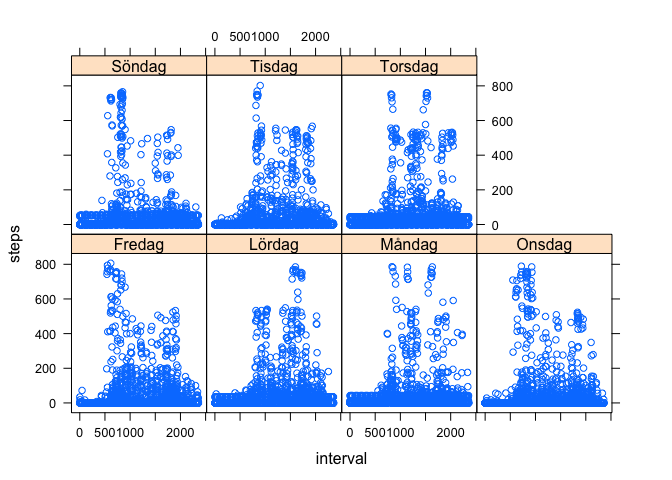

# Reproducible Research: Peer Assessment 1


## Loading and preprocessing the data
*Author: Jonatan Hedin*  
This report consists of an analysis of data from a personal activity monitoring device. This device collects data at 5 minute intervals through out the day. The data consists of two months of data from an anonymous individual collected during the months of October and November, 2012 and include the number of steps taken in 5 minute intervals each day.

We're starting with loading the needed packages, the needed data and transforming the date variable toPOSIXlt format.

We choose to put the data in a data frame as it is the most flexible format.


```r
library(lattice)
library(plyr)
library(xtable)
library(knitr)
fileURL="https://d396qusza40orc.cloudfront.net/repdata%2Fdata%2Factivity.zip"
download.file(fileURL, "activity.zip", mode="wb", method="curl")
unzip("activity.zip")
activity <- data.frame(read.csv("activity.csv"))
activity$date <- strptime(activity$date, format="%Y-%m-%d")
activity$day <- as.factor(strftime(activity$date, format="%d"))
```

## What is mean total number of steps taken per day?
As this part of the assignment requires us to calculate three daily statistics (step count, step mean, step median) we start by creating a summary data frame containing per day the count, the mean and the median. We use the 'aggregate' function to acheive this.


```r
steps.agg <- aggregate(steps ~ day, data=activity, FUN=function(activity) c(mean =mean(activity), median=median(activity),count=sum(activity) ), na.action = na.omit)
steps.agg <- data.frame(as.matrix(steps.agg))
steps.agg$steps.count <- as.numeric(as.character(steps.agg$steps.count))
```

The mean, median and total number of steps per day:

```r
kable(steps.agg, format="html")
```

<table>
 <thead>
  <tr>
   <th style="text-align:left;"> day </th>
   <th style="text-align:left;"> steps.mean </th>
   <th style="text-align:left;"> steps.median </th>
   <th style="text-align:right;"> steps.count </th>
  </tr>
 </thead>
<tbody>
  <tr>
   <td style="text-align:left;"> 02 </td>
   <td style="text-align:left;"> 18.62153 </td>
   <td style="text-align:left;"> 0.00000 </td>
   <td style="text-align:right;"> 10726 </td>
  </tr>
  <tr>
   <td style="text-align:left;"> 03 </td>
   <td style="text-align:left;"> 38.06076 </td>
   <td style="text-align:left;"> 0.00000 </td>
   <td style="text-align:right;"> 21923 </td>
  </tr>
  <tr>
   <td style="text-align:left;"> 04 </td>
   <td style="text-align:left;"> 42.06944 </td>
   <td style="text-align:left;"> 0.00000 </td>
   <td style="text-align:right;"> 12116 </td>
  </tr>
  <tr>
   <td style="text-align:left;"> 05 </td>
   <td style="text-align:left;"> 41.20312 </td>
   <td style="text-align:left;"> 0.00000 </td>
   <td style="text-align:right;"> 23733 </td>
  </tr>
  <tr>
   <td style="text-align:left;"> 06 </td>
   <td style="text-align:left;"> 41.23958 </td>
   <td style="text-align:left;"> 0.00000 </td>
   <td style="text-align:right;"> 23754 </td>
  </tr>
  <tr>
   <td style="text-align:left;"> 07 </td>
   <td style="text-align:left;"> 41.48958 </td>
   <td style="text-align:left;"> 0.00000 </td>
   <td style="text-align:right;"> 23898 </td>
  </tr>
  <tr>
   <td style="text-align:left;"> 08 </td>
   <td style="text-align:left;"> 11.17708 </td>
   <td style="text-align:left;"> 0.00000 </td>
   <td style="text-align:right;"> 3219 </td>
  </tr>
  <tr>
   <td style="text-align:left;"> 09 </td>
   <td style="text-align:left;"> 44.48264 </td>
   <td style="text-align:left;"> 0.00000 </td>
   <td style="text-align:right;"> 12811 </td>
  </tr>
  <tr>
   <td style="text-align:left;"> 10 </td>
   <td style="text-align:left;"> 34.37500 </td>
   <td style="text-align:left;"> 0.00000 </td>
   <td style="text-align:right;"> 9900 </td>
  </tr>
  <tr>
   <td style="text-align:left;"> 11 </td>
   <td style="text-align:left;"> 39.77778 </td>
   <td style="text-align:left;"> 0.00000 </td>
   <td style="text-align:right;"> 22912 </td>
  </tr>
  <tr>
   <td style="text-align:left;"> 12 </td>
   <td style="text-align:left;"> 48.86632 </td>
   <td style="text-align:left;"> 0.00000 </td>
   <td style="text-align:right;"> 28147 </td>
  </tr>
  <tr>
   <td style="text-align:left;"> 13 </td>
   <td style="text-align:left;"> 34.30903 </td>
   <td style="text-align:left;"> 0.00000 </td>
   <td style="text-align:right;"> 19762 </td>
  </tr>
  <tr>
   <td style="text-align:left;"> 14 </td>
   <td style="text-align:left;"> 52.42361 </td>
   <td style="text-align:left;"> 0.00000 </td>
   <td style="text-align:right;"> 15098 </td>
  </tr>
  <tr>
   <td style="text-align:left;"> 15 </td>
   <td style="text-align:left;"> 17.67361 </td>
   <td style="text-align:left;"> 0.00000 </td>
   <td style="text-align:right;"> 10180 </td>
  </tr>
  <tr>
   <td style="text-align:left;"> 16 </td>
   <td style="text-align:left;"> 35.63368 </td>
   <td style="text-align:left;"> 0.00000 </td>
   <td style="text-align:right;"> 20525 </td>
  </tr>
  <tr>
   <td style="text-align:left;"> 17 </td>
   <td style="text-align:left;"> 48.24826 </td>
   <td style="text-align:left;"> 0.00000 </td>
   <td style="text-align:right;"> 27791 </td>
  </tr>
  <tr>
   <td style="text-align:left;"> 18 </td>
   <td style="text-align:left;"> 43.69097 </td>
   <td style="text-align:left;"> 0.00000 </td>
   <td style="text-align:right;"> 25166 </td>
  </tr>
  <tr>
   <td style="text-align:left;"> 19 </td>
   <td style="text-align:left;"> 35.88542 </td>
   <td style="text-align:left;"> 0.00000 </td>
   <td style="text-align:right;"> 20670 </td>
  </tr>
  <tr>
   <td style="text-align:left;"> 20 </td>
   <td style="text-align:left;"> 25.81076 </td>
   <td style="text-align:left;"> 0.00000 </td>
   <td style="text-align:right;"> 14867 </td>
  </tr>
  <tr>
   <td style="text-align:left;"> 21 </td>
   <td style="text-align:left;"> 37.51389 </td>
   <td style="text-align:left;"> 0.00000 </td>
   <td style="text-align:right;"> 21608 </td>
  </tr>
  <tr>
   <td style="text-align:left;"> 22 </td>
   <td style="text-align:left;"> 58.83160 </td>
   <td style="text-align:left;"> 0.00000 </td>
   <td style="text-align:right;"> 33887 </td>
  </tr>
  <tr>
   <td style="text-align:left;"> 23 </td>
   <td style="text-align:left;"> 52.27778 </td>
   <td style="text-align:left;"> 0.00000 </td>
   <td style="text-align:right;"> 30112 </td>
  </tr>
  <tr>
   <td style="text-align:left;"> 24 </td>
   <td style="text-align:left;"> 39.64062 </td>
   <td style="text-align:left;"> 0.00000 </td>
   <td style="text-align:right;"> 22833 </td>
  </tr>
  <tr>
   <td style="text-align:left;"> 25 </td>
   <td style="text-align:left;"> 24.87153 </td>
   <td style="text-align:left;"> 0.00000 </td>
   <td style="text-align:right;"> 14326 </td>
  </tr>
  <tr>
   <td style="text-align:left;"> 26 </td>
   <td style="text-align:left;"> 31.14583 </td>
   <td style="text-align:left;"> 0.00000 </td>
   <td style="text-align:right;"> 17940 </td>
  </tr>
  <tr>
   <td style="text-align:left;"> 27 </td>
   <td style="text-align:left;"> 41.25868 </td>
   <td style="text-align:left;"> 0.00000 </td>
   <td style="text-align:right;"> 23765 </td>
  </tr>
  <tr>
   <td style="text-align:left;"> 28 </td>
   <td style="text-align:left;"> 37.57118 </td>
   <td style="text-align:left;"> 0.00000 </td>
   <td style="text-align:right;"> 21641 </td>
  </tr>
  <tr>
   <td style="text-align:left;"> 29 </td>
   <td style="text-align:left;"> 20.94618 </td>
   <td style="text-align:left;"> 0.00000 </td>
   <td style="text-align:right;"> 12065 </td>
  </tr>
  <tr>
   <td style="text-align:left;"> 30 </td>
   <td style="text-align:left;"> 34.09375 </td>
   <td style="text-align:left;"> 0.00000 </td>
   <td style="text-align:right;"> 9819 </td>
  </tr>
  <tr>
   <td style="text-align:left;"> 31 </td>
   <td style="text-align:left;"> 53.52083 </td>
   <td style="text-align:left;"> 0.00000 </td>
   <td style="text-align:right;"> 15414 </td>
  </tr>
</tbody>
</table>

  
### A histogram for each day, showing the distribution of steps taken


```r
histogram(~steps|day, data=activity)
```

 

## What is the average daily activity pattern?
Here we will group the data by interval instead of by day.


```r
steps.agg.int <- aggregate(steps ~ interval, data=activity, FUN=function(activity) c(mean =mean(activity), median=median(activity),count=sum(activity) ), na.action = na.omit)
steps.agg.int <- data.frame(as.matrix(steps.agg.int))
steps.agg.int$steps.count <- as.numeric(as.character(steps.agg.int$steps.count))
```


```r
plot(steps.agg.int$interval, steps.agg.int$steps.count, type="l", main="Steps per 5 min-interval over total period", xlab="Interval", ylab="Total no. of steps")
```

 

### Which 5-minute interval contains max no of steps?


```r
m <-steps.agg.int[which.max(steps.agg.int$steps.count),1]
print(m)
```

```
## [1] 835
```
The 5-minute interval with the maximum total/average steps is 835.

## Imputing missing values

### Number of rows with NA's
The number of rows with missing values can be calculated using th is.na() function.


```r
n.is.na <- sum(is.na(activity$steps))
print(n.is.na)  
```

```
## [1] 2304
```
 
The number of rows with missing steps values is 2304.

### Imputing missing values
We're substituting any NA here with the mean for that day, creating a new dataset called activity2.


```r
impute.mean <- function(x) replace(x, is.na(x), mean(x, na.rm = TRUE))
activity3 <- activity[,-2]
activity2 <- ddply(activity3, ~ day, transform, steps = impute.mean(steps))
```

Just like with the original dataset we're calculating summary statistics for each day: Mean, total steps and median.


```r
steps.agg2 <- aggregate(steps ~ day, data=activity2, FUN=function(activity2) c(mean =mean(activity2), median=median(activity2),count=sum(activity2) ), na.action = na.omit)
steps.agg2 <- data.frame(as.matrix(steps.agg2))
steps.agg2$steps.count <- as.numeric(as.character(steps.agg2$steps.count))
```

A histogram for each day, showing the distribution of steps taken with imputations made


```r
histogram(~steps|day, data=activity2)
```

 


The mean, median and total number of steps per day with imputations:

```r
kable(steps.agg2, format="html")
```

<table>
 <thead>
  <tr>
   <th style="text-align:left;"> day </th>
   <th style="text-align:left;"> steps.mean </th>
   <th style="text-align:left;"> steps.median </th>
   <th style="text-align:right;"> steps.count </th>
  </tr>
 </thead>
<tbody>
  <tr>
   <td style="text-align:left;"> 02 </td>
   <td style="text-align:left;"> 18.62153 </td>
   <td style="text-align:left;"> 0.00000 </td>
   <td style="text-align:right;"> 10726 </td>
  </tr>
  <tr>
   <td style="text-align:left;"> 03 </td>
   <td style="text-align:left;"> 38.06076 </td>
   <td style="text-align:left;"> 0.00000 </td>
   <td style="text-align:right;"> 21923 </td>
  </tr>
  <tr>
   <td style="text-align:left;"> 04 </td>
   <td style="text-align:left;"> 42.06944 </td>
   <td style="text-align:left;"> 42.06944 </td>
   <td style="text-align:right;"> 24232 </td>
  </tr>
  <tr>
   <td style="text-align:left;"> 05 </td>
   <td style="text-align:left;"> 41.20312 </td>
   <td style="text-align:left;"> 0.00000 </td>
   <td style="text-align:right;"> 23733 </td>
  </tr>
  <tr>
   <td style="text-align:left;"> 06 </td>
   <td style="text-align:left;"> 41.23958 </td>
   <td style="text-align:left;"> 0.00000 </td>
   <td style="text-align:right;"> 23754 </td>
  </tr>
  <tr>
   <td style="text-align:left;"> 07 </td>
   <td style="text-align:left;"> 41.48958 </td>
   <td style="text-align:left;"> 0.00000 </td>
   <td style="text-align:right;"> 23898 </td>
  </tr>
  <tr>
   <td style="text-align:left;"> 08 </td>
   <td style="text-align:left;"> 11.17708 </td>
   <td style="text-align:left;"> 11.17708 </td>
   <td style="text-align:right;"> 6438 </td>
  </tr>
  <tr>
   <td style="text-align:left;"> 09 </td>
   <td style="text-align:left;"> 44.48264 </td>
   <td style="text-align:left;"> 44.48264 </td>
   <td style="text-align:right;"> 25622 </td>
  </tr>
  <tr>
   <td style="text-align:left;"> 10 </td>
   <td style="text-align:left;"> 34.37500 </td>
   <td style="text-align:left;"> 34.37500 </td>
   <td style="text-align:right;"> 19800 </td>
  </tr>
  <tr>
   <td style="text-align:left;"> 11 </td>
   <td style="text-align:left;"> 39.77778 </td>
   <td style="text-align:left;"> 0.00000 </td>
   <td style="text-align:right;"> 22912 </td>
  </tr>
  <tr>
   <td style="text-align:left;"> 12 </td>
   <td style="text-align:left;"> 48.86632 </td>
   <td style="text-align:left;"> 0.00000 </td>
   <td style="text-align:right;"> 28147 </td>
  </tr>
  <tr>
   <td style="text-align:left;"> 13 </td>
   <td style="text-align:left;"> 34.30903 </td>
   <td style="text-align:left;"> 0.00000 </td>
   <td style="text-align:right;"> 19762 </td>
  </tr>
  <tr>
   <td style="text-align:left;"> 14 </td>
   <td style="text-align:left;"> 52.42361 </td>
   <td style="text-align:left;"> 52.42361 </td>
   <td style="text-align:right;"> 30196 </td>
  </tr>
  <tr>
   <td style="text-align:left;"> 15 </td>
   <td style="text-align:left;"> 17.67361 </td>
   <td style="text-align:left;"> 0.00000 </td>
   <td style="text-align:right;"> 10180 </td>
  </tr>
  <tr>
   <td style="text-align:left;"> 16 </td>
   <td style="text-align:left;"> 35.63368 </td>
   <td style="text-align:left;"> 0.00000 </td>
   <td style="text-align:right;"> 20525 </td>
  </tr>
  <tr>
   <td style="text-align:left;"> 17 </td>
   <td style="text-align:left;"> 48.24826 </td>
   <td style="text-align:left;"> 0.00000 </td>
   <td style="text-align:right;"> 27791 </td>
  </tr>
  <tr>
   <td style="text-align:left;"> 18 </td>
   <td style="text-align:left;"> 43.69097 </td>
   <td style="text-align:left;"> 0.00000 </td>
   <td style="text-align:right;"> 25166 </td>
  </tr>
  <tr>
   <td style="text-align:left;"> 19 </td>
   <td style="text-align:left;"> 35.88542 </td>
   <td style="text-align:left;"> 0.00000 </td>
   <td style="text-align:right;"> 20670 </td>
  </tr>
  <tr>
   <td style="text-align:left;"> 20 </td>
   <td style="text-align:left;"> 25.81076 </td>
   <td style="text-align:left;"> 0.00000 </td>
   <td style="text-align:right;"> 14867 </td>
  </tr>
  <tr>
   <td style="text-align:left;"> 21 </td>
   <td style="text-align:left;"> 37.51389 </td>
   <td style="text-align:left;"> 0.00000 </td>
   <td style="text-align:right;"> 21608 </td>
  </tr>
  <tr>
   <td style="text-align:left;"> 22 </td>
   <td style="text-align:left;"> 58.83160 </td>
   <td style="text-align:left;"> 0.00000 </td>
   <td style="text-align:right;"> 33887 </td>
  </tr>
  <tr>
   <td style="text-align:left;"> 23 </td>
   <td style="text-align:left;"> 52.27778 </td>
   <td style="text-align:left;"> 0.00000 </td>
   <td style="text-align:right;"> 30112 </td>
  </tr>
  <tr>
   <td style="text-align:left;"> 24 </td>
   <td style="text-align:left;"> 39.64062 </td>
   <td style="text-align:left;"> 0.00000 </td>
   <td style="text-align:right;"> 22833 </td>
  </tr>
  <tr>
   <td style="text-align:left;"> 25 </td>
   <td style="text-align:left;"> 24.87153 </td>
   <td style="text-align:left;"> 0.00000 </td>
   <td style="text-align:right;"> 14326 </td>
  </tr>
  <tr>
   <td style="text-align:left;"> 26 </td>
   <td style="text-align:left;"> 31.14583 </td>
   <td style="text-align:left;"> 0.00000 </td>
   <td style="text-align:right;"> 17940 </td>
  </tr>
  <tr>
   <td style="text-align:left;"> 27 </td>
   <td style="text-align:left;"> 41.25868 </td>
   <td style="text-align:left;"> 0.00000 </td>
   <td style="text-align:right;"> 23765 </td>
  </tr>
  <tr>
   <td style="text-align:left;"> 28 </td>
   <td style="text-align:left;"> 37.57118 </td>
   <td style="text-align:left;"> 0.00000 </td>
   <td style="text-align:right;"> 21641 </td>
  </tr>
  <tr>
   <td style="text-align:left;"> 29 </td>
   <td style="text-align:left;"> 20.94618 </td>
   <td style="text-align:left;"> 0.00000 </td>
   <td style="text-align:right;"> 12065 </td>
  </tr>
  <tr>
   <td style="text-align:left;"> 30 </td>
   <td style="text-align:left;"> 34.09375 </td>
   <td style="text-align:left;"> 34.09375 </td>
   <td style="text-align:right;"> 19638 </td>
  </tr>
  <tr>
   <td style="text-align:left;"> 31 </td>
   <td style="text-align:left;"> 53.52083 </td>
   <td style="text-align:left;"> 0.00000 </td>
   <td style="text-align:right;"> 15414 </td>
  </tr>
</tbody>
</table>

The clearest difference between the summary statistics of the original aggregate table and the aggregate table after imputed means, is that the total number of steps is higher for each day of the month, and some days of the month has a non-zero median.

## Are there differences in activity patterns between weekdays and weekends?


```r
activity2 <- cbind(activity2, activity$date)
colnames(activity2) <- c("steps", "interval", "day", "date")
activity2$weekdayz <- weekdays(activity2$date)
activity2$weekend <- activity2$weekdayz
#levels(activity2$weekend) <- c("weekday", "weekend", "weekday", "weekday", "weekend", #"weekday", "weekday")  
levels(activity2$weekend) <-list("weekday" = c("Fredag","Måndag","Onsdag","Tisdag",  "Torsdag"), "weekend"=c("Lördag", "Söndag"))
```


Histogram showing the difference in step pattern weekday vs weekend:

```r
xyplot(steps~interval|weekend, data=activity2)  
```

 

It is obvious that the movement pattern starts later on weekends, and that the movement pattern is more distinct arount mornings, lunch and afternoons on weekdays.
